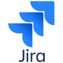

# Hi there, I'm Artemy
 
### QA Automation Engineer

</a>

🌱 I’m currently learning **AQA, Java, Linux**

Детально

    
     
    

Технологии

Code

Infrastructure

Tests visualization

Tests notifications

Workflow

### Проекты

-
-
-

